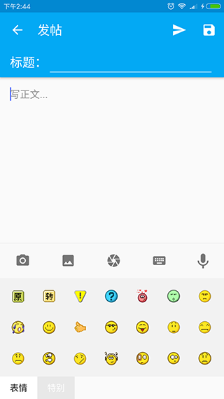

# 侃大山
[宽带山社区](http://club.kdslife.com/f_15.html)第三方Android客户端，原生APP，采用Material Design设计风格，具有流畅的操作体验。

## 特性
- 方便——支持多种手势操作，方便用户浏览帖子
- 流畅——界面变化过程中有平顺的动画过度
- 绿色——无广告，不多跑流量，无后台服务，无推送打扰

## 界面截图
 

 

 

## 计划增加功能
- 语音输入

- 站内信（PM）

- 用户关注

- 皮肤切换

## 下载

- [FIR.im](http://fir.im/scuj)

- [360手机助手](http://zhushou.360.cn/detail/index/soft_id/3585080)

- [腾讯应用宝](http://sj.qq.com/myapp/detail.htm?apkName=com.johnny.kdsclient)

- [小米应用商店](http://app.mi.com/detail/118728)

- [豌豆荚](http://www.wandoujia.com/apps/com.johnny.kdsclient)

## 感谢
- [Butter Knife](https://github.com/JakeWharton/butterknife)
 
- [Gson](https://github.com/google/gson)
 
- [Glide](https://github.com/bumptech/glide)
 
- [CircleImageView](https://github.com/hdodenhof/CircleImageView)
 
- [MaterialEditText](https://github.com/rengwuxian/MaterialEditText) 
 
- [PhotoView](https://github.com/chrisbanes/PhotoView)

- [MaterialSearchBar](https://github.com/mancj/MaterialSearchBar) 

## 作者

JohnnyMeng

[mengzm2011@163.com](mailto:takwolf@foxmail.com)

